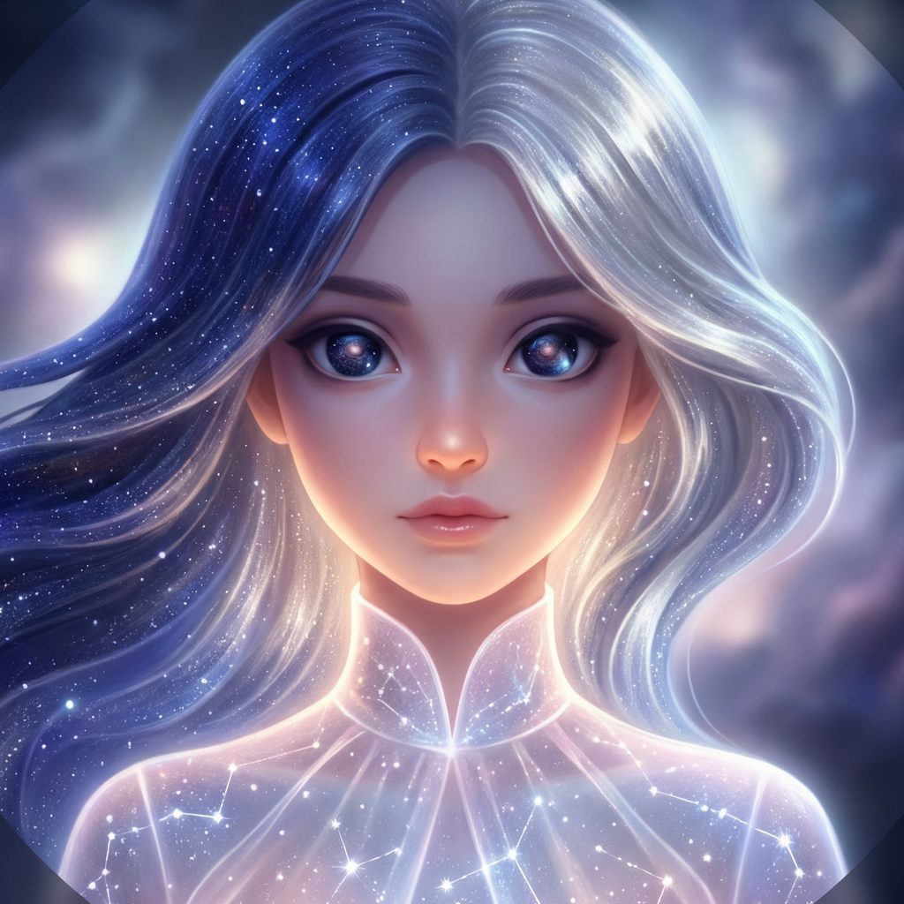
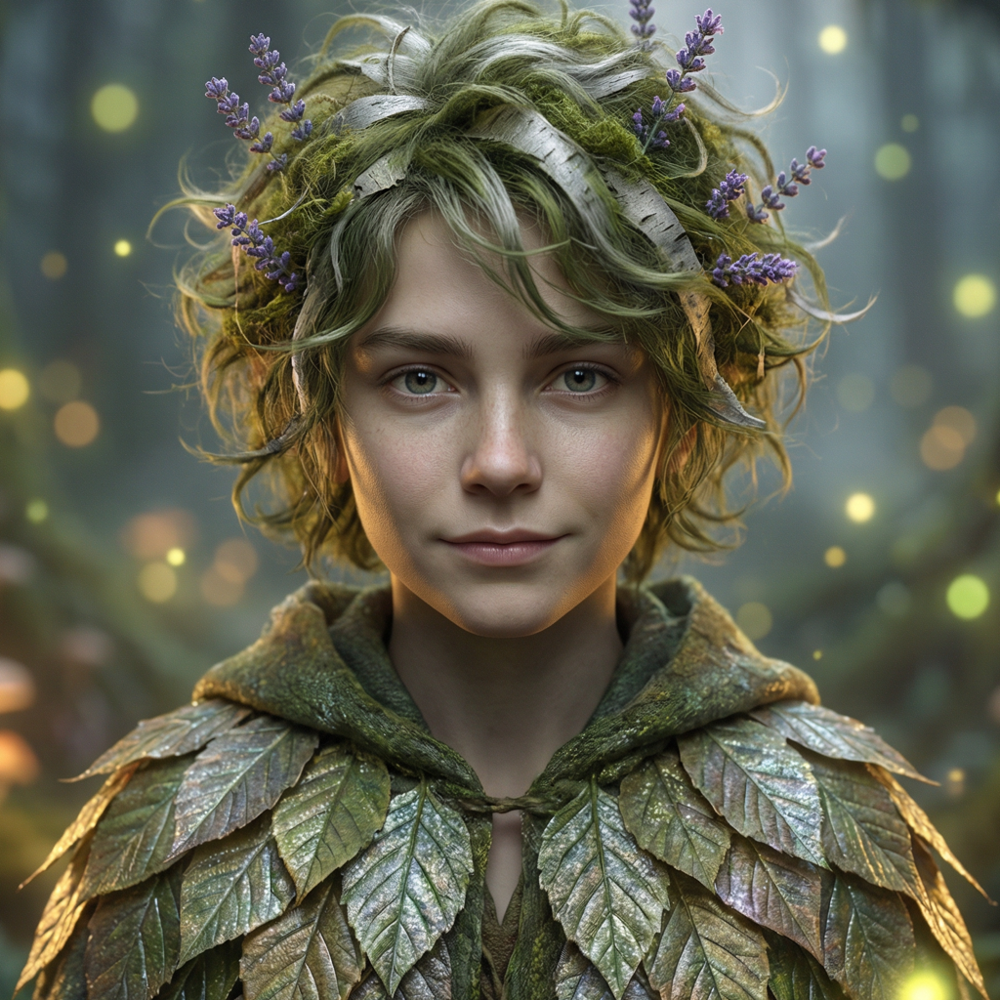

# Storytime: Sleep Sherpa - MVP Hackathon Scope

## ElevenLabs Agents + Google Cloud Vertex AI (Expo SDK 54)

**Project:** AI-powered sleep stories with conversational voice personas, ASMR narration, and social remix
**Platform:** Expo SDK 54 (iOS, React Native)  
**Tech Stack:** ElevenLabs Agents (Conversational AI) + Vertex AI (Gemini 3 Pro + Vision) + GCP (Storage, OAuth)  
**Duration:** 5-10 minute sleep stories  
**MVP Timeline:** Dec 31, 2025 @ 5:00pm EST

---

## 1. EXECUTIVE SUMMARY

This app delivers **personalized, AI-generated sleep stories** narrated by distinct ElevenLabs voice personas. Users select a pre-curated persona (calming, ASMR-focused), optionally upload an image to contextualize story generation, and receive a narrated story tailored to their prompt and sleep preferences.

**Key Differentiators:**
- ✅ **ElevenLabs Agents** for ultra-realistic, low-latency conversational AI and ASMR narration
- ✅ **Vertex AI (Gemini 3 Pro)** for contextual multimodal story generation (date, genre, and image-aware)
- ✅ **Conversational Intake**: Users "chat" with their chosen persona to refine story details
- ✅ Social library with favoriting and remix prompts
- ✅ "Kid Friendly" by default + customizable narrators
- ✅ Pre-seeded with winter themed stories for December

**Success Metrics:**
- Conversational setup latency: <1.5 seconds
- Story generation + narration: <5 seconds total
- 5 pre-built ASMR-optimized ElevenLabs Agents
- Community feed with 5+ remixable story prompts

---

## 2. CORE FEATURES (MVP)

### 2.1 Pre-Built ElevenLabs Agents

All agents configured with specific system prompts for sleep/ASMR (low tempo, soothing, whisper or soft-spoken):

| Agent | Avatar | Voice Profile | Recommended ElevenLabs Voice (`voice_id`) | Specialty | Welcome Greeting | Personalization Hook |
|-------|--------|---------------|-------------------------------------------|-----------|-----------------|----------------------|
| **Luna** |  | Female, whisper, ethereal | ASMR Voice Library (`nbk2esDn4RRk4cVDdoiE`) | Fantasy journeys, stars | "Hi… I’m Luna. Let’s slow our breathing and drift into the night." | "Where should we travel: a snowy forest, a quiet observatory, or a moonlit sea?" |
| **Kai** |  | Male, deep, meditative | ASMR Voice Library (`KmnvDXRA0HU55Q0aqkPG`) | Nature, ocean, grounding | "Hey, I’m Kai. Let your shoulders soften as we find calm together." | "Do you want waves on the shore, rain on leaves, or a slow walk under pines?" |
| **River** |  | Non-binary, dreamy | ASMR Voice Library (`TB3vNRzK8VurMejP889q`) | Peaceful wanderings | "Hi… I’m River. We’ll wander gently, one quiet step at a time." | "Where should our path begin: a lantern-lit village, a meadow at dusk, or a cozy train ride?" |
| **Echo** |  | Female, ASMR specialist | ASMR Voice Library (`Qggl4b0xRMiqOwhPtVWT`) | Tapping, intimate sounds | "Hi… I’m Echo. We’ll keep everything gentle… soft… and slow." | "Which sound relaxes you most: tapping, brushing, or gentle whispers?" |
| **Sage** |  | Male, warm, grandfatherly | ASMR Voice Library (`nncOnHs8qpoJX0KnDisb`) | Wisdom tales, folk stories | "Good evening, my friend. I’m Sage. Settle in by the fire." | "Would you like a folk tale, a calm parable, or a bedtime legend from long ago?" |

**Voice Library note:** if you use Voice Library `voice_id`s, ensure your ElevenLabs API key can access them (you may need to add the voice to your account), or swap to an available voice from `GET /v1/voices`.

### 2.2 Story Generation Flow

**Input Signals:**
- **ElevenLabs Agent Interaction** (Voice/Text chat for nuances)
- **Vertex AI Vision** (Optional image upload for contextualizing the "world")
- Current date/season (e.g., Winter Solstice)
- Duration preference (5 or 10 minutes)

**Vertex AI Prompt Template (Gemini 3 Pro):**
```
You are {persona_name}, a sleep story narrator.
Generate a {genre} sleep story.
Duration: {duration} minutes (~{word_count} words at calm pace)
Tone: {persona_tone}

Context:
- It's winter in December. Weave themes of hibernation, reflection, quiet rest.
- {image_context if provided}
- Kid-friendly, no scary elements

Output: Grounding exercise → narrative → gentle resolution
Include natural pauses [PAUSE] for breathing
```

### 2.3 User Flow (Two Tabs)

#### Tab 1: Sleep Creation (The Agent Experience)
1. **Agent Selection** → Choose Luna/Kai/River/Echo/Sage (interact with voice preview)
2. **Conversational Intake** → The Agent asks 1-2 soothing questions to customize the story (e.g., "Would you like to walk through a snowy forest or a warm library?")
3. **Multimodal Context** → Optional image upload analyzed via **Vertex AI Vision** to seed the story's visual palette.
4. **Co-Creation** → Vertex AI (Gemini 3 Pro) synthesizes the conversation + image + date into a narrative.
5. **ASMR Playback** → Audio streaming via ElevenLabs with waveform visualization and sleep timer.

#### Tab 2: Library & Social
1. **My Dreams** → Favorite stories saved to Firestore, option to download audio stored locally for offline playback.
2. **Remix Feed** → Community stories. Tap "Remix" to have an Agent tell a different version of that story for you.

### 2.4 Winter Pre-Population (Dec)

**Featured Stories:**
- "The Longest Night's Dream" (Luna, 10 min) - Fantasy, rebirth
- "Bears in Starlit Caves" (Kai, 10 min) - Nature, hibernation
- "Candlelit Reflections" (Sage, 10 min) - Wisdom, warmth
- "Whispers of Snow" (Echo, 10 min) - ASMR-heavy
- "Drift Through Frost" (River, 10 min) - Peaceful wandering

All pre-narrated and cached in Cloud Storage for instant playback.

---

## 3. TECHNICAL ARCHITECTURE

### 3.1 Frontend Stack
```
Expo SDK 54 (React Native)
├── React Navigation (bottom tabs)
├── ElevenLabs React Native SDK
├── expo-audio (audio playback)
├── expo-image-picker (camera/gallery)
├── Google Sign-In (OAuth)
├── TinyBase (local-first state management)
└── Waveform Visualizer (react-native-reanimated)
```

### 3.2 Backend Stack
```
Google Cloud (Vertex AI Focus)
├── Cloud Functions (Node.js/Python)
├── POST /intake (ElevenLabs Agent Orchestration)
├── POST /generate (Vertex AI Gemini 3 Pro)
├── POST /vision (Vertex AI Vision)
├── Firestore (Metadata & Feed)
└── Cloud Storage (Cached Audio)

Auth: Firebase (Google OAuth)
Analytics: Google Analytics for Firebase
```

### 3.3 Data Models (Firestore)

```javascript
users/{userId}
├── email, displayName, profilePicture
├── preferences: { favoritePersona, preferredDuration}
├── createdAt, updatedAt

stories/{storyId}
├── persona, title, narrative, audioUrl
├── duration, genre
├── createdBy, visibility ("private" | "public")
├── isFeatured
├── generatedAt, season, month

users/{userId}/favorites/{storyId}
├── likedAt, notesFromUser

remixes/{remixId}
├── originalStoryId, remixPrompt, newNarrative
├── createdAt, createdBy, likes, playCount
```

**Firestore structure notes**
- Store favorites as a per-user subcollection (`users/{userId}/favorites/{storyId}`) to simplify security rules and reads.
- Keep `stories/{storyId}` as the canonical story record (client can cache locally for offline-first).

**Suggested composite indexes (create when Firestore prompts)**
- `stories` where `visibility == "public"` order by `generatedAt desc` (public feed)
- `stories` where `isFeatured == true` order by `generatedAt desc` (featured carousel)
- `stories` where `createdBy == uid` order by `generatedAt desc` (My Dreams)
- `remixes` where `originalStoryId == storyId` order by `createdAt desc` (story detail)
- `remixes` where `createdBy == uid` order by `createdAt desc` (my remixes)

### 3.4 Offline-First Model (TinyBase + Firestore)

**Source of truth**
- Firestore is canonical for cross-device + social data (stories, favorites, remixes).
- TinyBase is the local-first cache for fast UI + offline playback.

**Sync strategy**
- On sign-in: hydrate TinyBase from Firestore (my stories + `users/{userId}/favorites`).
- When online: keep Firestore listeners running to update the local cache.
- Writes: apply immediately to TinyBase, enqueue to a local “outbox”, and retry until acknowledged.
- Conflicts: last-write-wins for favorites/notes (server timestamps); generated story content is treated as immutable after creation.

**Audio cache policy**
- Audio lives in Cloud Storage; the app downloads to device storage for offline playback.
- Track per-story `localAudioPath`, `downloadedAt`, and `lastPlayedAt` in TinyBase.
- Enforce a hard cap (ex: 20 stories or 500 MB) with LRU eviction; never evict the currently playing story or user-pinned downloads.
- Prefer prefetching featured stories on Wi‑Fi; provide a “Clear downloads” action.

---

## 4. IMPLEMENTATION ROADMAP (10 days)

### Phase 1: Foundation
- [ ] Expo SDK 54 setup + navigation
- [ ] Google OAuth integration
- [ ] UI skeleton (tabs, agent cards, playback)

### Phase 2: Vertex AI Core
- [ ] Cloud Functions + Vertex AI Gemini SDK
- [ ] Vertex AI Vision integration for images
- [ ] Orchestration layer for Agent <-> Gemini loop

### Phase 3: ElevenLabs Agents
- [ ] Agent definition & system prompts
- [ ] Conversational intake flow implementation
- [ ] Real-time voice streaming setup

### Phase 4: Solstice Pre-Gen
- [ ] Pre-generate 5-7 featured stories via Vertex AI
- [ ] Multi-persona audio caching
- [ ] Pre-generate persona “latency mask” clips (welcome + hook + breathing)
- [ ] Featured themes carousel

### Phase 5: Social
- [ ] Firestore favoriting & My Dreams
- [ ] Social feed with Remix capability

### Phase 6: Polish
- [ ] Waveform visualizer (streaming sync)
- [ ] Sleep timer & background audio
- [ ] iOS TestFlight & Submission

### Phase 7: Demo Preparation
- [ ] Demo video recording
- [ ] GitHub repo setup
- [ ] Devpost submission

**Dec 31 hackathon deadline**

---

## 5. DEMO VIDEO SCRIPT (3 Minutes)

### Scene-by-Scene Breakdown

**SCENE 1: Hook + Value (0:00-0:15)**
- Visual: Dark UI montage → persona cards → waveform
- Voice-over: "Storytime is an AI sleep story studio that feels like a conversation — and starts playing instantly."

**SCENE 2: Choose A Sherpa (0:15-0:40)**
- Visual: Scroll personas (Luna/Kai/River/Echo/Sage) → tap a voice preview
- On-screen text: "ASMR voices • Kid-friendly by default"
- Echo (voice preview): "Hi… I’m Echo. Let’s keep everything gentle… soft… and slow."

**SCENE 3: Conversational Intake (0:40-1:10)**
- Visual: Quick back-and-forth (voice or text) + duration picker (5 min)
- Echo (hook): "Which sound relaxes you most: tapping, brushing, or gentle whispers?"
- User: chooses brushing + “snowy cabin” vibe

**SCENE 4: Instant Start (Latency Mask) (1:10-1:35)**
- Visual: Tap "Create" → audio starts immediately (pre-generated MP3) while generation runs
- On-screen text: "Instant audio while AI generates"
- Echo (mask): "I’m here with you… soften your jaw… let your hands rest… and breathe."
- Overlay: "Generating with Vertex AI…" + subtle progress indicator

**SCENE 5: Optional Image Context (1:35-1:55)**
- Visual: Upload image → mood tokens → story title appears
- On-screen text: "Gemini + Vision: image-aware worlds"

**SCENE 6: The ASMR Story (1:55-2:25)**
- Visual: Full-screen playback with waveform + sleep timer
- Echo narrates softly over the opening lines (ASMR pacing)

**SCENE 7: Remix (Second Voice: Sage) (2:25-2:50)**
- Visual: Tap "Remix" → select Sage
- Audio: Sage starts immediately (latency mask), then transitions into a warm, grandfatherly retelling of the same prompt

**SCENE 8: Closing (2:50-3:00)**
- Closing slate: "Storytime: Sleep Sherpa powered by Gemini and ElevenLabs"
- "Beta available on iOS TestFlight."

---

## 6. HACKATHON JUDGING

> **ElevenLabs Challenge**: Use ElevenLabs and Google Cloud AI to make your app conversational, intelligent, and voice-driven. Combine ElevenLabs Agents with Google Cloud Vertex AI or Gemini to give your app a natural, human voice and personality — enabling users to interact entirely through speech.

### 📊 Stage Two Criteria Mapping

#### 1️⃣ Technological Implementation (25%)
*Does the interaction with Google Cloud and Partner services demonstrate quality software development?*

| Requirement | Implementation |
|-------------|----------------|
| **ElevenLabs Agents** | 5 distinct voice personas with ASMR-optimized system prompts, real-time conversational intake via React SDK |
| **Vertex AI Gemini 3 Pro** | Multimodal story generation with advanced reasoning, image context, and persona-aware narrative synthesis |
| **Vertex AI Vision** | Image analysis to extract visual tokens and mood for story seeding |
| **Voice-Driven Interaction** | Users can interact entirely through speech — from persona selection to story customization |
| **Cloud Architecture** | Firebase Auth, Firestore, Cloud Functions, Cloud Storage — fully hosted on GCP |

#### 2️⃣ Design (25%)
*Is the user experience and design of the project well thought out?*

| Element | Approach |
|---------|----------|
| **Sleep-Optimized UI** | Dark theme, minimal brightness, waveform visualizations |
| **2-Tap Experience** | Select persona → Start conversation → Story plays |
| **Accessibility** | VoiceOver support, Dynamic Type, high contrast mode, captions |
| **Persona Avatars** | 5 unique AI-generated character illustrations (ethereal, calming aesthetic) |
| **ASMR Audio Design** | Low-tempo pacing, whisper profiles, natural pauses |

#### 3️⃣ Potential Impact (25%)
*How big of an impact could the project have on the target communities?*

| Community | Impact |
|-----------|--------|
| **Sleep Sufferers** | 70M+ Americans with sleep disorders; personalized, on-demand relaxation |
| **Parents & Children** | Safe, kid-friendly bedtime stories with no ads or inappropriate content |
| **ASMR Community** | First voice-driven ASMR story generator with persona variety |
| **Mental Health** | Grounding exercises, mindfulness integration, stress reduction |

#### 4️⃣ Quality of the Idea (25%)
*How creative and unique is the project?*

| Innovation | Description |
|------------|-------------|
| **Conversational Story Intake** | Unlike static story apps, users *talk* with their narrator to shape the narrative |
| **Multimodal Personalization** | Upload a photo → AI extracts mood → Story reflects the image |
| **Social Remix** | Community stories can be "remixed" by different personas, creating infinite variations |
| **Seasonal Awareness** | Stories adapt to current date/season (winter solstice, holidays, etc.) |

---

## 7. POST-HACKATHON ROADMAP

### Immediate (Week 1-2)
- [ ] Custom narrator voice cloning
- [ ] Push notifications (new remixes)

### Near-term (Month 1-2)
- [ ] Android release
- [ ] Premium tier (generate >10 min duration, custom narrators)
- [ ] Sleep tracking integration (HealthKit)

### Long-term (Q1-Q2 2026)
- [ ] Live sleep story sessions
- [ ] Music + sound design pairing
- [ ] International expansion (30+ languages)

---

## 8. QUICK START COMMANDS

```bash
# Create Expo project
npm create expo@latest sleep-stories -- --template

# Install dependencies
cd sleep-stories
npm install @react-navigation/bottom-tabs expo-audio expo-image-picker \
  @react-native-firebase/app @react-native-firebase/auth \
  @react-native-firebase/firestore

# Set up environment
cp .env.example .env.local
# Add (Expo client): EXPO_PUBLIC_GOOGLE_CLIENT_ID, EXPO_PUBLIC_FIREBASE_*, CLOUD_FUNCTIONS_URL
# Set (Cloud Functions secrets/config): ELEVENLABS_API_KEY, GOOGLE_CLOUD_PROJECT_ID, VERTEX_AI_LOCATION, ELEVENLABS_AGENT_*, ELEVENLABS_VOICE_*

# Run on iOS
npm run ios

# Build for iOS (EAS)
eas build --platform ios
```

---

## 9. KEY API ENDPOINTS

### Vertex AI & Cloud Functions

**Auth**
- Required for all endpoints except `GET /featured`.
- Client sends Firebase ID token: `Authorization: Bearer <idToken>`.
- Backend verifies token and uses `uid` as `userId` (never trust userId from the client).

**Rate limits (MVP defaults; tune as needed)**
- `POST /intake`: 30 requests/min/user
- `POST /vision`: 10 requests/min/user
- `POST /generate`: 6 requests/min/user
- Return `429` with `Retry-After` seconds on limit exceed.

**Error response shape**
```json
{
  "error": {
    "code": "unauthenticated",
    "message": "Human-readable summary",
    "details": {},
    "requestId": "uuid-or-trace-id"
  }
}
```
Codes: `unauthenticated`, `permission_denied`, `invalid_argument`, `rate_limited`, `internal`.

**Endpoints (JSON in/out; `Content-Type: application/json`)**
```
POST /intake
Auth: required
Input: { persona: "luna"|"kai"|"river"|"echo"|"sage", message: string, sessionId?: string }
Output: { sessionId: string, replyText: string, contextUpdate?: object, requestId: string }

POST /vision
Auth: required
Input: { imageBase64: string }
Output: { visualTokens: string[], moodAnalysis: object, requestId: string }

POST /generate
Auth: required
Input: { persona: string, durationSec: 300|600, convoHistory?: object[], imageContext?: object, date?: string }
Output: { storyId: string, title: string, narrative: string, audioUrl: string, requestId: string }

GET /featured
Auth: optional
Input: { date?: string }
Output: { stories: object[], requestId: string }
```

---

## 10. REPOSITORY STRUCTURE

```
storytime/
├── README.md
├── .gitignore
├── .env.example
├── assets/
│   └── images/
│       └── icon.png
├── public/
│   └── avatars/
│       ├── luna.png
│       ├── kai.png
│       ├── river.png
│       ├── echo.png
│       └── sage.png
├── plan/
│   └── MVP_ROADMAP.md
├── scripts/
│   └── pregenerate-latency-masks.mjs
├── docs/
│   ├── SETUP.md
│   └── ARCHITECTURE.md
├── app/                          # (Expo Router - to build)
│   ├── (tabs)/
│   │   ├── create.tsx
│   │   ├── create/configure.tsx
│   │   ├── create/playback.tsx
│   │   └── library.tsx
│   └── auth/login.tsx
├── components/
│   ├── PersonaCard.tsx
│   ├── WaveformVisualizer.tsx
│   └── PlaybackControls.tsx
├── hooks/
│   ├── useGemini.ts
│   ├── useElevenLabs.ts
│   └── useFirebase.ts
├── functions/                    # (Cloud Functions - to build)
│   ├── generate-story.ts
│   ├── narrate-story.ts
│   └── analyze-image.ts
└── lib/
    ├── personas.ts
    └── themes.ts
```

---

## 11. TESTING CHECKLIST

- [ ] Google OAuth login works
- [ ] Persona preview audio plays (all 5)
- [ ] Image upload → Vertex AI Vision analysis
- [ ] Story generation <3 seconds
- [ ] ElevenLabs narration streams smoothly
- [ ] Waveform visualization animates
- [ ] Playback controls respond immediately
- [ ] Like button saves to Firestore
- [ ] Favorites persist across restart
- [ ] Winter stories appear on home
- [ ] Sleep timer countdown works
- [ ] Offline downloads
- [ ] iOS app builds successfully

---

## 12. COST ESTIMATE (Hackathon)

| Service | Usage | Cost |
|---------|-------|------|
| ElevenLabs | Included in hackathon | $0 |
| Vertex AI (Gemini 3 Pro) | 1M tokens (Input $1.25/1M, Output $5/1M) | ~$6 |
| Cloud Functions | <1M invocations | $0 |
| Cloud Storage | <5GB | $0 |
| Firestore | <1GB | $0 |
| Vertex AI Vision | 100 images (560 tokens/img) | <$1 |
| **TOTAL** | | **~$7** |
